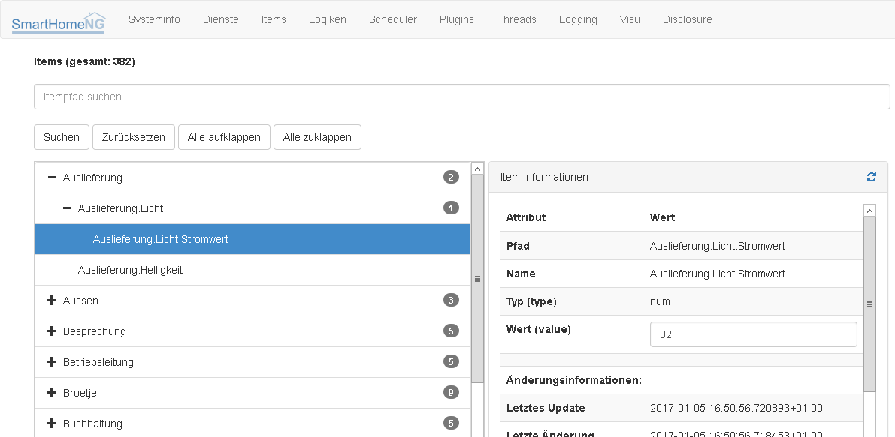
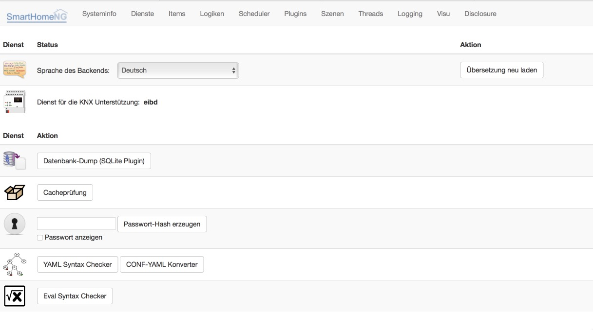
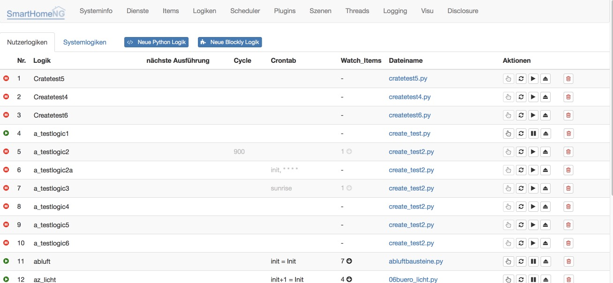
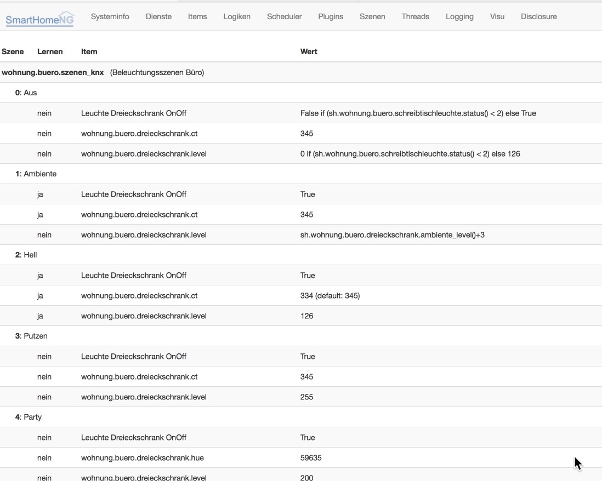

# SmartHomeNG installieren


- Schritte der Installation:
    - [zusätzliche Pakete installieren](#zusätzliche-pakete-installieren-1)
    - [Quellcode laden](#quellcode-laden)
    - [Erstmalige Konfiguration erstellen](#erstmalige-konfiguration-erstellen)
    - [Zusätzliche Python Module](#zusätzliche-python-module)
    - [SmartHomeNG starten](#smarthomeng-starten)
    - [Backend Plugin nutzen](#backend-plugin-nutzen)


### zusätzliche Pakete installieren

Zunächst müssen einige zusätzlichen Pakete erfüllt werden:
<!---
apt-get update nicht notwendig
openssh-server apache2  git-core wget bereits installiert
--->

<!---
```
sudo apt-get -y install dialog openntpd python3 python3-dev python3-setuptools unzip build-essential
sudo easy_install3 pip
```
--->

```
sudo apt-get -y install dialog python3 python3-dev python3-setuptools unzip build-essential
sudo apt-get install python3-pip
```

Dann noch Pythons Paketmanager PIP auf den neuesten Stand bringen:

```
sudo python3 -m pip install --upgrade pip
```

[comment]: # (Alternativ sollte auch ein)
[comment]: # (```)
[comment]: # (sudo easy_install3 -U pip)
[comment]: # (```)
[comment]: # (zum Ergebnis führen.)


### Quellcode laden

SmartHomeNG Dateien vom github holen:

```
cd /usr/local
sudo mkdir smarthome
sudo chown -R smarthome:smarthome /usr/local/smarthome

cd smarthome
git clone git://github.com/smarthomeNG/smarthome.git .

mkdir plugins
cd plugins
git clone git://github.com/smarthomeNG/plugins.git .
```
Bitte auf den Punkt am Ende der **git clone** Kommandos achten!


### Erstmalige Konfiguration erstellen

#### smarthome.yaml

In der **smarthome.yaml** stehen die Koordinaten des Standortes der Installation. Die Koordinaten werden benötigt um unter anderem Sonnenaufgang / -untergang zu berechnen.
Die Koordinaten für einen Standort kann man z.B. [hier](http://www.mapcoordinates.net/de) ermitteln.

Alternativ kann die mitgelieferte **smarthome.yaml.default** kopiert werden in **smarthome.yaml** mit ``cp smarthome.yaml.default smarthome.yaml``
oder das folgende Code snippet kann von der **cat** Zeile an bis zur Zeile unter **EOL** ausgewählt und ins ssh kopiert werden.

```
cat >smarthome.yaml <<EOL
# smarthome.yaml
lat: '52.52'
lon: '13.40'
elev: 36
tz: Europe/Berlin
EOL
```

In beiden Fällen sollte der Inhalt von **smarthome.yaml** nun mit einem Editor (z.B. **nano**) angepasst werden.


#### plugin.yaml

Auch hier wird eine **plugin.yaml.default** mitgeliefert mit den meisten Voreinstellungen die per ``cp plugin.yaml.default plugin.yaml``
kopiert werden kann, allerdings sind in dieser Datei alle Einstellungen zunächst auskommentiert **#**.
Alternativ dazu kann analog zur obigen **smarthome.yaml** das folgende Code snippet von der **cat** Zeile an bis zur Zeile unter **EOL** ausgewählt und ins ssh kopiert werden:

```
cat >plugin.yaml <<EOL
# plugin.yaml

# Der BackendServer stellt eine Übersicht zur Laufzeit dar und liefert Informationen ähnlich wie das CLI Plugin
# Der Zugriff erfolgt über http://<IP oder Name des SmartHomeNG Servers bzw. ip>:<port>
# port wird als Attribut weiter unten definiert
# das Passwort ist zunächst im Klartext anzugeben. In neueren Versionen wird es eine Funktion im Backend geben,
# die aus einem gegebenen Passwort einen Hash erzeugt. Wenn user oder password fehlen gibt es keine Abfrage
BackendServer:
    class_name: BackendServer
    class_path: plugins.backend
    # ip: xxx.xxx.xxx.xxx
    port: 8383
    updates_allowed: 'True'
    threads: 8
    user: admin
    password: xxxx
    language: de

# KNX Verbindung via knxd
knx:
    class_name: KNX
    class_path: plugins.knx
    host: 127.0.0.1
    port: 6720
    # send_time: 600 # update date/time every 600 seconds, default none
    # time_ga: 1/1/1 # default none
    # date_ga: 1/1/2 # default none

# Bereitstellung eines Websockets zur Kommunikation zwischen SmartVISU und SmartHomeNG
visu:
    class_name: WebSocket
    class_path: plugins.visu_websocket
    # ip: 0.0.0.0
    # port: 2424
    # tls: no
    wsproto: 4
    acl: rw

# Autogenerierung von Webseiten für SmartVISU
smartvisu:
    class_name: SmartVisu
    class_path: plugins.visu_smartvisu
    # '"neue" Linux Versionen (z.B. Debian > 8.x, Ubuntu > 14.x)'
    smartvisu_dir: /var/www/html/smartVISU

    # nur \"alte\" Linux-Variationen
    # smartvisu_dir: /var/www/smartVISU
    # generate_pages: True
    # handle_widgets: True
    # overwrite_templates: Yes
    # visu_style: blk

# Command Line Interface
# wichtig für Funktionsprüfungen solange keine Visu zur Verfügung steht
cli:
    class_name: CLI
    class_path: plugins.cli
    ip: 0.0.0.0
    update: 'True'

# alter SQL-Treiber
# [sql]
# class_name: SQL
# class_path: plugins.sqlite
# SQL-Treiber, unterstützt auch die SmartVISU 2.8/2.9
# dazu muß im websocket plugin zwingend die Protokollversion 4 eingetragen sein

sql:
    class_name: SQL
    class_path: plugins.sqlite_visu2_8

# Onewire Plugin
# [ow]
# class_name: OneWire
# class_path: plugins.onewire
EOL
```

### Zusätzliche Python Module

Wieder zurück nach **/usr/local/smarthome** mit ```cd ..``` oder ```cd /usr/local/smarthome```

Für den ersten Start müssen noch einige Module nachgeladen werden, dazu wird für den Core die mitgelieferte **requirements/base.txt** genutzt:

```
sudo pip3 install -r requirements/base.txt
```

Jedes Plugin kann weitere Abhängigkeiten mit sich bringen. Diese sind einzeln zu installieren mit

```
sudo pip3 install -r plugins/<plugin-name-hier-einsetzen>/requirements.txt
```

oder aber alternativ kann man auch sämtliche von allen Plugins benötigten Module nachladen über

```
sudo pip3 install -r requirements/all.txt
```


### SmartHomeNG starten
Erstmalig bietet es sich an, SmartHomeNG im Debugmodus zu starten um zu sehen was passiert und ob Fehler auftauchen.
Dafür ausführen:

```
cd /usr/local/smarthome/bin
python3 ./smarthome.py -d
```

Jetzt sollten jede Menge Logging-Meldungen über den Bildschirm laufen, die sehen in etwa so aus:

```
2017-08-05  00:00:07 DEBUG    M:lib.scheduler  T:Scheduler    IT.SwitchB next time: 2017-01-05 00:02:07+01:00
2017-08-05  00:00:14 WARNING  M:plugins.dlms   T:DLMS         update is alrady running, maybe it really takes very long or you should use longer query interval time
2017-08-05  00:00:14 DEBUG    M:lib.scheduler  T:Scheduler    DLMS next time: 2017-01-05 00:01:44+01:00
```
Vorne steht Datum und Uhrzeit, dann der Loglevel (DEBUG, ERROR, WARNING, INFO), dann je nach Setup in der Datei logging.yaml noch Modul, Thread und ein Meldungstext der den Logeintrag beschreibt.

Wir schauen nach ERROR und WARNING und versuchen diese zu vermeiden.
ToDo: Erweitern.

### Backend Plugin nutzen
Wenn jetzt erstmal SmartHomeNG am Laufen ist, sollte auch das Backend funktionieren. Dazu prüfen wir im Browser unter der Adresse **`http://<IP vom SmartHomeNG>:8383`** den Zugriff.
Bei der Frage nach Benutzer und Passwort geben wir **admin** und **xxxx** ein. Jetzt ist erstmal die Spielwiese eröffnet. Der Backendserver ist unabhängig von der SmartVISU und funktioniert auch dann, wenn ihr kein visu Plugin geladen habt. Ein paar Bilder vom Backendserver:

Der Item-Tree:


Die Dienste/Tools Seite:


Die Logik-Liste:


Die Szenen Übersicht:

